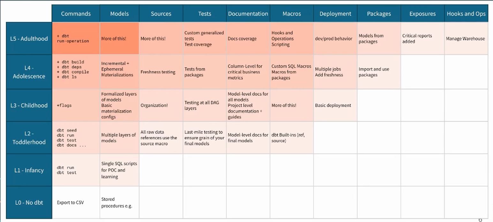
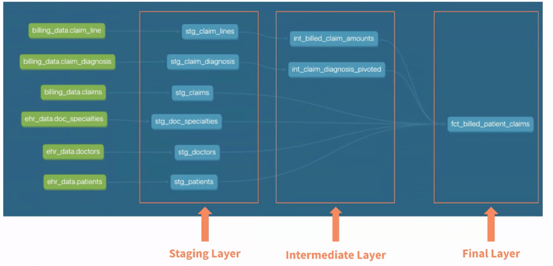
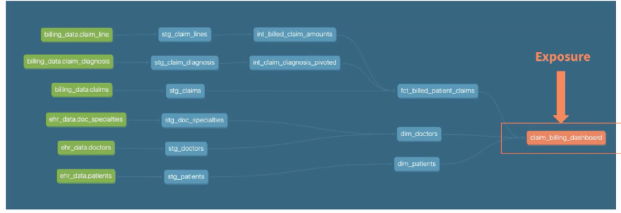
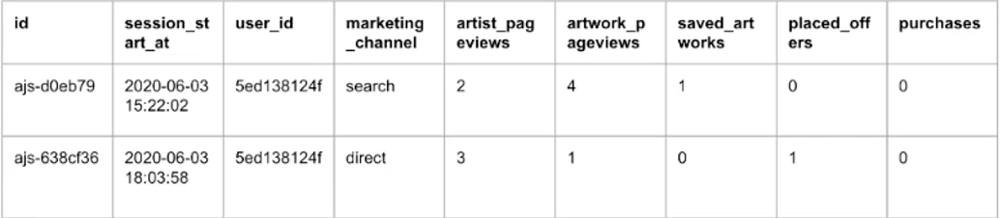
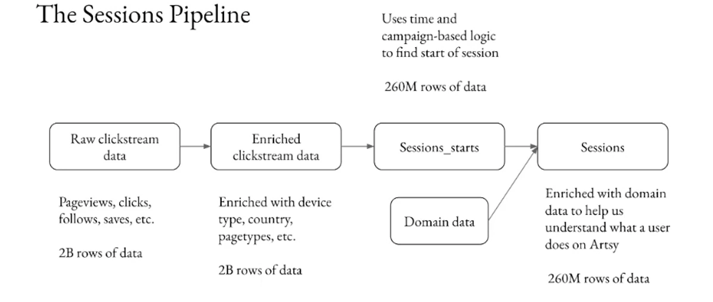
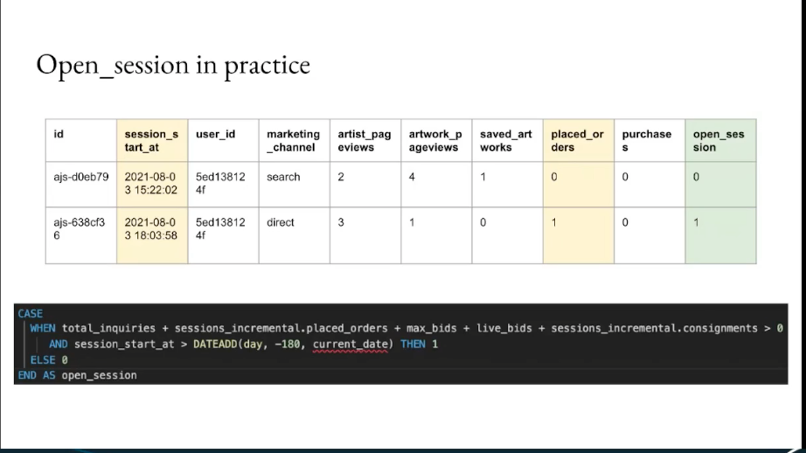
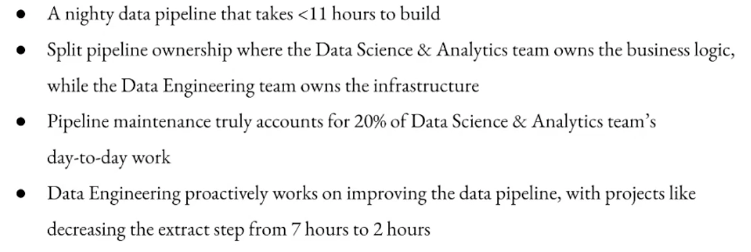

# Coalesce 2021 - Notes

# Monday - 6/12/2021 

## How to build a mature dbt project from scratch - Dave Matthews - dave@dbtlabs.com

### Items to investigate 
    -  Metadata API  

- a number of distince stages
- maturity :
    - feature completeness : does your project use features [ tests / documentation]
- Depth
    - are you effectively using DBT's features for you ?
    - medium : testing => mature : unified /standardized testing.

###  DBT maturity 
Repo :https://github.com/dbt-labs/dbt-project-maturity     

* Jinja allows us to modularize our code
* The DAG becomes more complex, but is way more modularized.

#### L3 -  Childhood 

- scaleable as goal, using standards which makes sure you have quality as you scale. High tech debt if you don't.
- meta regarding the project [linting / PR template, etc. ]
- codification of the features.
- Every single project should get here

#### L4 - Adolescence 

- newest additions - packages 
- not needed, and will depend on the specific data needs
- more dimensions, flexibility, context, and speed
- expand scope, model optimizations, and source metadata. Engage with the dbt community. This will increase dbts surface areas and influence in the org. You will lose stakeholder buy in if you don't

#### L5 - Adulthood 
- answer some of the big questions 
- improve the product itself, with more metadata, relationships with other stack tools. This will incrase observality and more control. 
- Hooks and macros become more complex. Introspective queries. Project starts to self-reflect.
- test / docuementation coverage. 
- **Metadata API ?????**

--- 

## Identity Crisis: Navigating the Modern Data Organization -  Panel

* **lots of fluff here, not really a great talk.. was expecting more**

* going from consuming data to building the platform to find the insights in the data. 
* Lots about coming into the career and being unsure about the opportunities. 
* Less about title, but moreso about the team and thier experiences, each with an area of focus. 
* lots of relationship building and cultural building when in a startup. 
* the title of analytics engineer coming in made it much easier to self-identify professionaly.

--- 
# Tuesday
---

## Tailoring dbt's incremental_strategy to Artsy's data needs - Abhiti Prabahar 

### Items to investigate 
    -  build time graph 

- Artsy : basically Etsy for art? [ scaled @ 1M visitors a week]
- Before : 
    * 16 hr build with Looker [ 100 users] 
    * 100% ownership of the pipeline
    * no testing.
- After
    * Graph migration 
    * CircleCI testing [end to end pipeline]
    * transparency with  alerting in slack 
- Transform step was taking 7 hrs [same with Extract]
    - micro-optimization of the transform step

* 50% of the build time comes from a model of `sessions`. 
* Sessions are super imprortant to this business. 
    - what is the converstation rate of email vs search ?

- This data can be super wide, important to keep an eye on this. 

- incrementalization
    - transforming data from 1 day, rather than the entire table.
    - entire sessions pipeline has been incrementalized
- **graph for build time ? - should research** 

- activities that can change in the future. All these activities needed to take place 180 days  in the past.

    - instead of rebilding the world, only rebuild those rows with the session_open
    - Instead of 17hrs => 5.5Hrs
        - Immutable : rebuild for the past day 
        - Mutablle : rebuild all rows that are open session or all data in the past 1 day .

--- 

## Smaller Black Boxes: Towards Modular Data Products - Stephen Bailey 

---

## Operationalizing Column-Name Contracts with dbtplyr - Emily Riederer 

- each step in the pipeline relies on human input [ with some amount of expectations for them . ]
- column names are contracts [ persists throughout the stack]

--- 