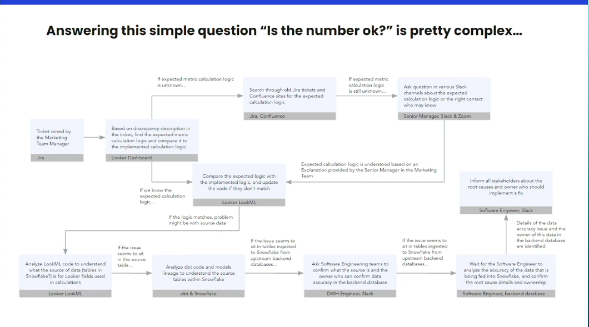
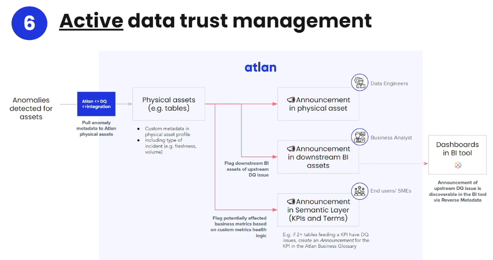

# Beyond the buzz: 20 real metadata use cases in 20 minutes with Atlan and dbt Labs
link : https://attendees.bizzabo.com/396530/agenda/activity/967453
Partner : ATLAN

- Data does not look right ?
  - 8 hours of audit logs : loss of agility
  - trust broke, which is key
    - loss of trust in the data team means a lot of time and effort to return it to the status quo.
- active metadata category.
  -  lots of nice customers( `elastic/snap commerce / wework`)

- Streamlining analyst service requests
  - 40 % of bandwidth on ad hoc requests - yikes.
  - data as a product 
    - column-level lineage
  - speeding up onboarding / ramp up.
- metrics can have asset profile 
  - ownerships,description
  - ex :`revenue` : how does it actually get made /derived
- 

- notion of certified tables 
  - data contracts

### Active Trust Management

- active change alerting ( such as stitch changing the migration)
- management of security classification
  - tags for the confidentiality 
    - we could use this for PII [ the column level lineage would propogate this.]
- scaling clusters up and down based on the load.
- atlan widget `within` Tableau..
  - you basically get the ability to show details about any metric.
    - is it trustworthy? is there an alert on it ? 
    - all within Tableau