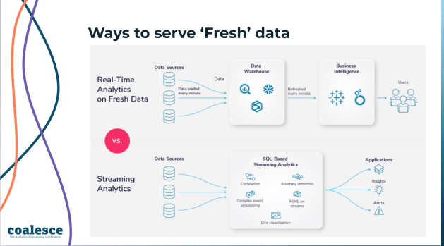
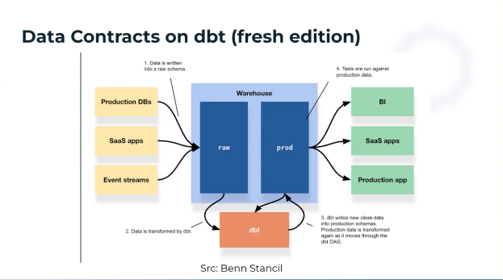

# Deliver Fresh Data with dbt and Striim
Link : https://attendees.bizzabo.com/396530/agenda/activity/967414

https://www.striim.com/podcast/

Data freshness: time since the data was last updated.
  - but what does it really mean ?
    - time of last `dbt model run` 
    - time of last ETL sync?
    - what if something happens in the pipeline ?
  - what if source is fresh, but downstream is delayed?
- Data freshness example
  - near-realtime inventory, fraud stuff, in -experience offers
- CDC [ change data capture]
  - get transaction logs 
    - get all DMLs
      - more of an audit log rather than raw DML createtion.
    - 
- 

Given that the reason for freshness is to provide most up to date analytics, whenever there is a DDL [ ex: an added column] on a extremely large DAG, is there a good way to balance the want to incorporate that CDC swiftly in prod vs ensuring all the testing is done ? Is this an example of having to collaborate on the true understanding of an SLA? 

- set of DDLs that can happen vs unexpected DDL [ that is where the testing is done.]
  - unexpected DDLs will just need to understand the impact on the SLA.
  - 