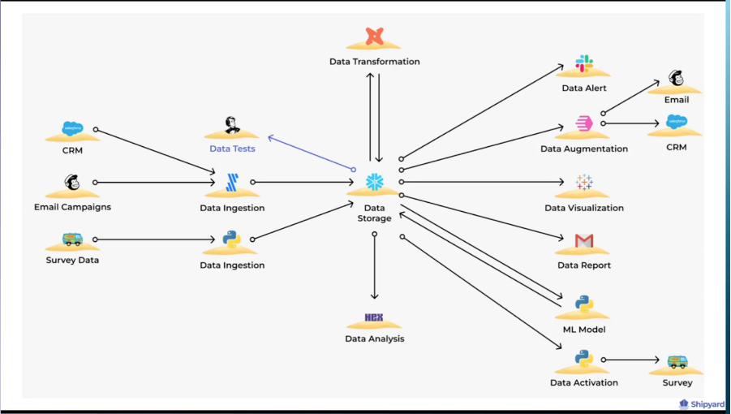
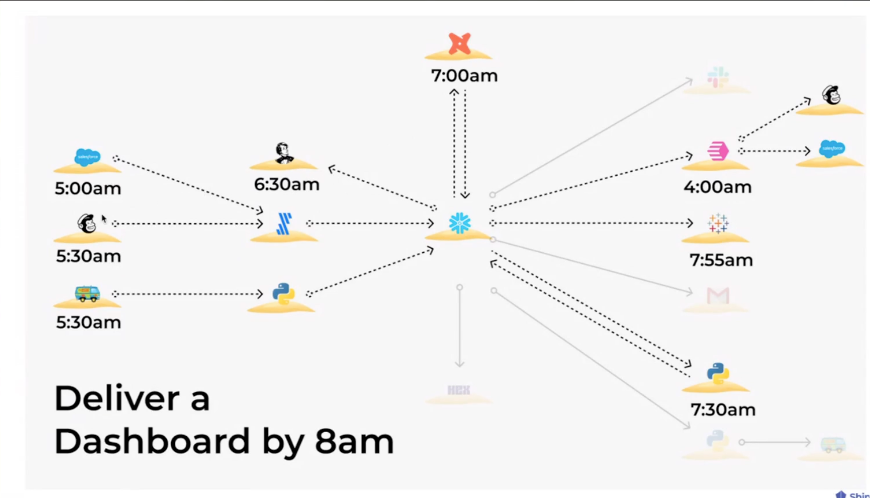

# Escape from Data Island
session : https://attendees.bizzabo.com/396530/agenda/activity/967422

## Data island
- tools are running indepedently 
- no clue how the data gets used
  - when/ how/ who is using the models
- fires are breaking out regularly
- no one trusts the data

### Example : points ot failure

## Timings

- you have a pipeline, and you need to run it in that way, such as enforcment
- the shipyard demo is actually kind of sweet. 
  -  the orchestration part is quite nice 
  -  www.wordstoworkflows.com  this is neat.
 
