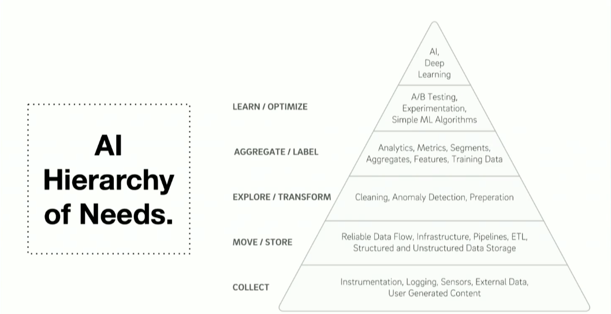
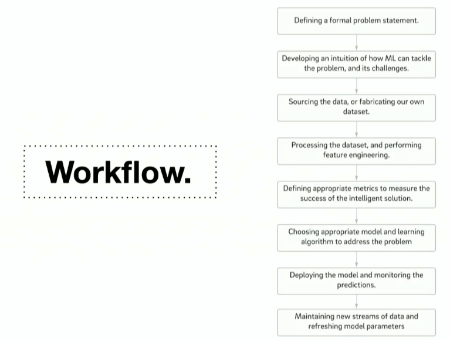

# Sculpting Data for ML
session : https://attendees.bizzabo.com/396530/agenda/activity/967392

- keys :  well calibrated data, good algorithims, efficient computation
- lots of data might 

**garbage in, garbage out** 

#### Data Curation 
- organization challenges : scaling up data and algos to meet the needs 
- needs skills to curate the datasets for ingestion 

## Approaches
- formal problem defintion 
  - EX ; given a user and a product with different sizes, we want to ensure best fit for a user.
- Interesting problem rec : data signals worth considering / lead to fascinating results.
- Metadata association
- Data volume Requirements
- Data Uniqness check

### Dataset preparation
Data Trimming
- remove data that you don't need anything for 
Data Integration 
- Vertical integration 
  - fusing articles [ sarcastic vs not sarcastic]
Horizontal Integration
- integrate with multiple sources as you can. 
- Feature Engineering is absolutely key 
  - boost performance
  - increases transparency
  - reduce need  for hyper parameter tuning

Key takeaway : your data should be massaged well enough such that even a simple algo will provide insights.

- book  : sculpting data for ML