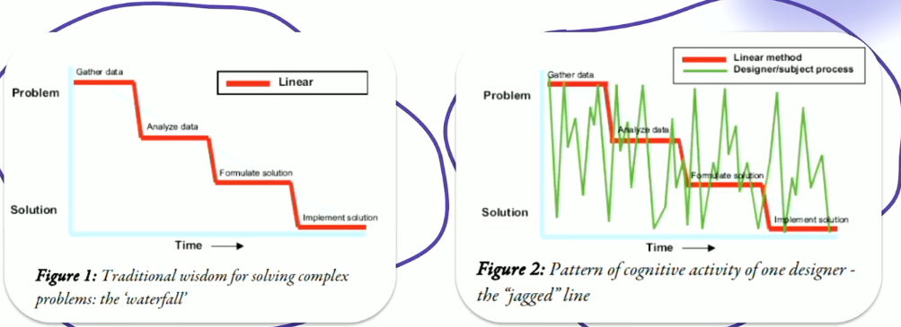
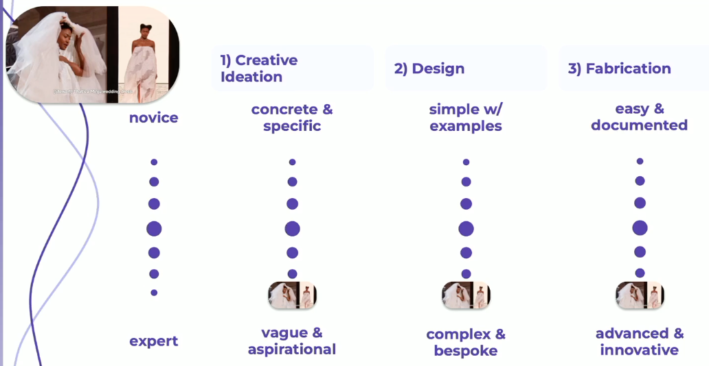
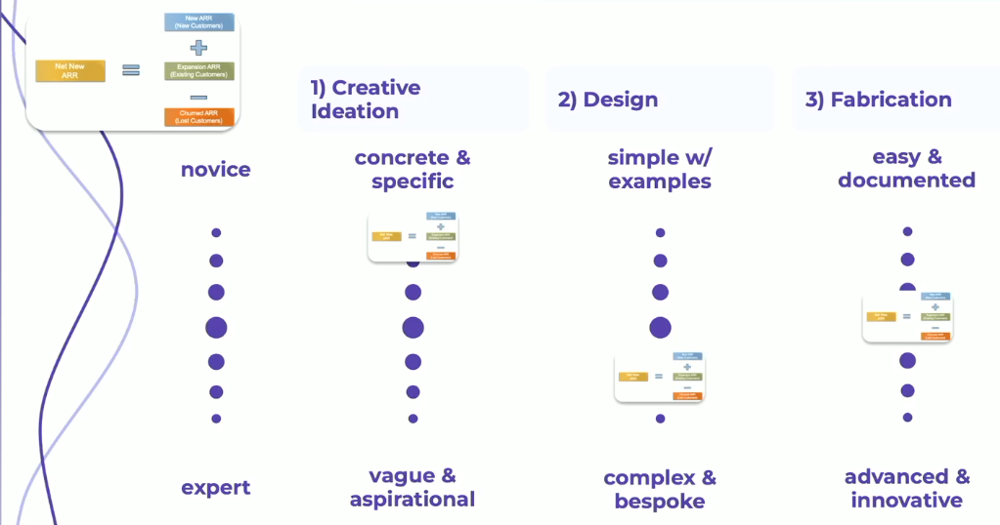
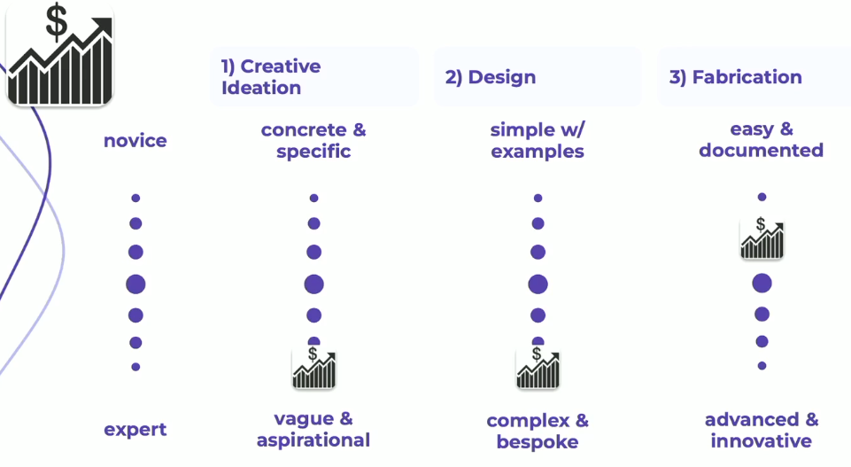
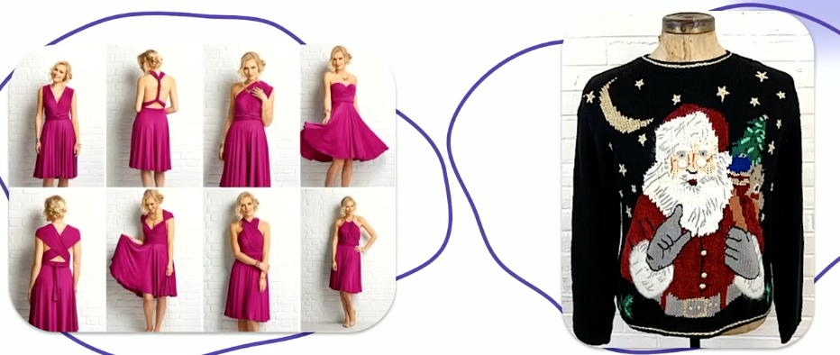
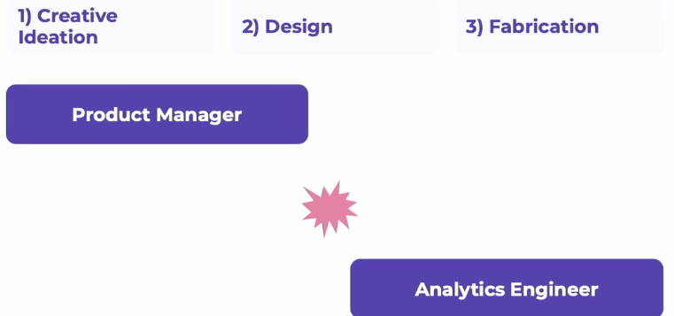
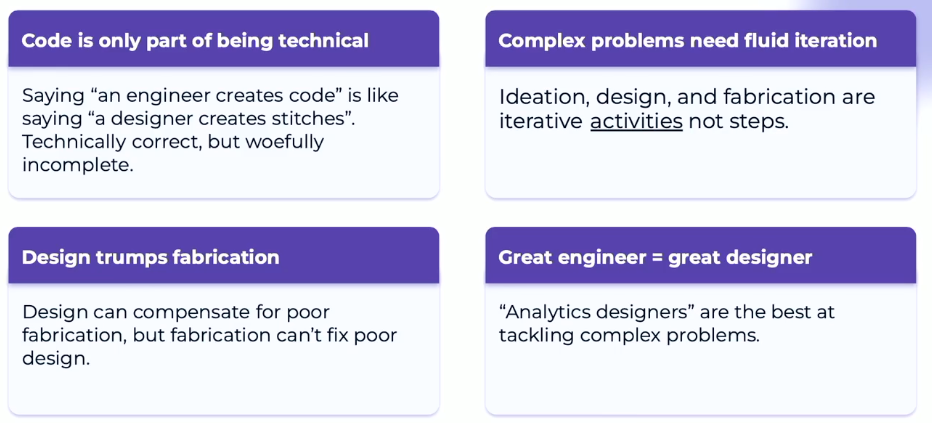

# The Missing Link

session link : https://attendees.bizzabo.com/396530/agenda/activity/967398

What is the missing link between `use-case` and `code that does things` : **design**

## Data, but make it fashion
- Prompt  [ Biz need / user story]
  - creative ideation [ sketches / choosing how to approach the prompt] [ potential user experiences ] 
    - innovate ,memorable, realistic
  - Design [designing a solution]
    - tools/ techniques to do the thing
  - Fabrication [implementation]
    - had to work ad-hoc
  - Delivery [user feedback]
    - test of the item.

> Lesson 1 : saying a data person makes code is like saying a designer stitches.. technically correct, but incomplete.

- if you go down the steps, you may need to go back to the previous steps [ maybe even the first step]

> Lesson 2: The steps are iterative activities, not steps

- tote bag is clearly defined, easy to make and basically anyone can make it. 
- The wedding dress 
  - prompt : vague and aspirational
  - design : complex and bespoke
  - fabrication : advanced and innovative.

### Net New ARR Example 

### Improve Profitablility

> Lesson 3 : Design can compensate for poor fabrication , but fabrication can't fix poor design

- The dress on the left is not great fabrication, but the design makes it easy and clean. The santa clause is super hard to do[fabricate] ,but the design is bad.. result is a bad-looking item

Main idea : either the engineer has to basically own the process or the product manager and engineers need to be lockstep, and they need to be perfectly in line.
  - Engineers should not be doing shadow design. 

> Lesson 4 : `Analytics Designers` are the best at tackling complex problems

### Summarized
