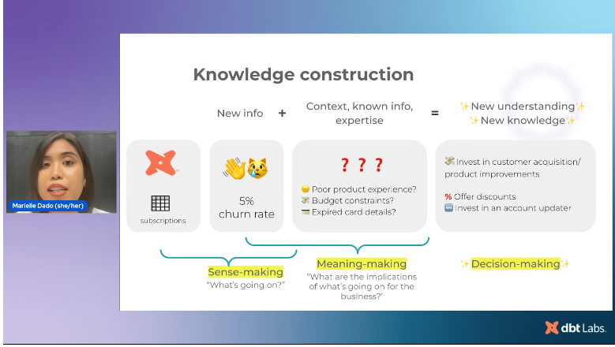
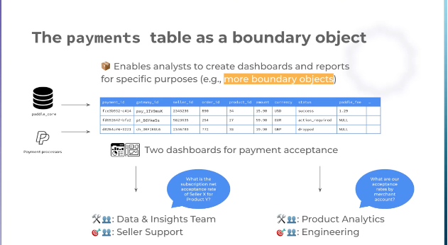

# I Don't Build Models 

Session Link : https://attendees.bizzabo.com/396530/agenda/activity/967381

### Theory of Knowledge Construction

### Analytics
- goal : positive biz impact
- involves:  collaboration/ working towards same goal
- multidisc teams - need common ground 
- `single source of truth` : common place to start from based on thier expertise
  - clean data set : shared frame reference

#### Boundary Objects
- something that different people can recogonize as the same thing, but has a different meaning to others.
  - cardboard box example
    - we all know what a box is, but to a cat, it might be a house for example.
  - User identity and personas
    - sales/ engineering /bizops [ grounded on the same ideas.]
    - spotify example : https://spotify.design/article/the-story-of-spotify-personas
  - 

#### Paddle - boundary object
##### Product : complete payments infra for SaaS
- `payment table` : boundary object 
  - served as anchor : is it `payments` or `transactions`?
    - since Paddle is based on payments, people are more likely to search `payements`.
    - The table itself leads to many different knowledge construction
    - 
      - separate discussions, but on the same grounds

- data requests need to fit the scope of the table.
    - are refunded payments part of the `payment` ?
      - well.. in order to be refunded, it needs to exist, and since `payments` are at attempt grain, a `refunded` payment exists, so this is fine. 

